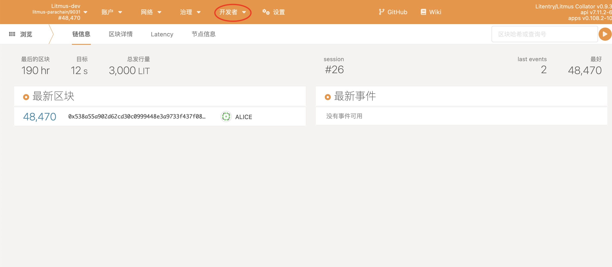
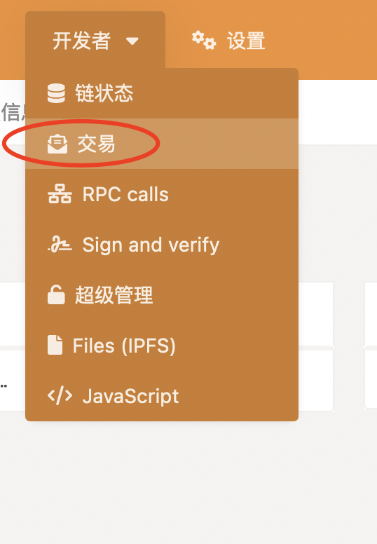
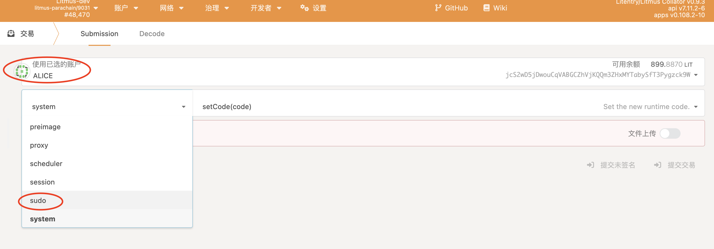
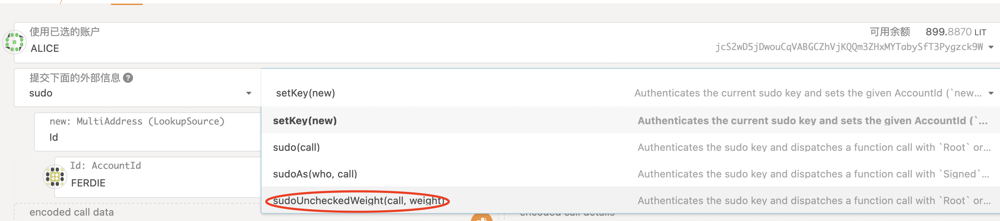
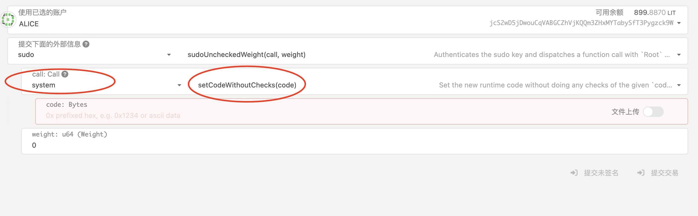
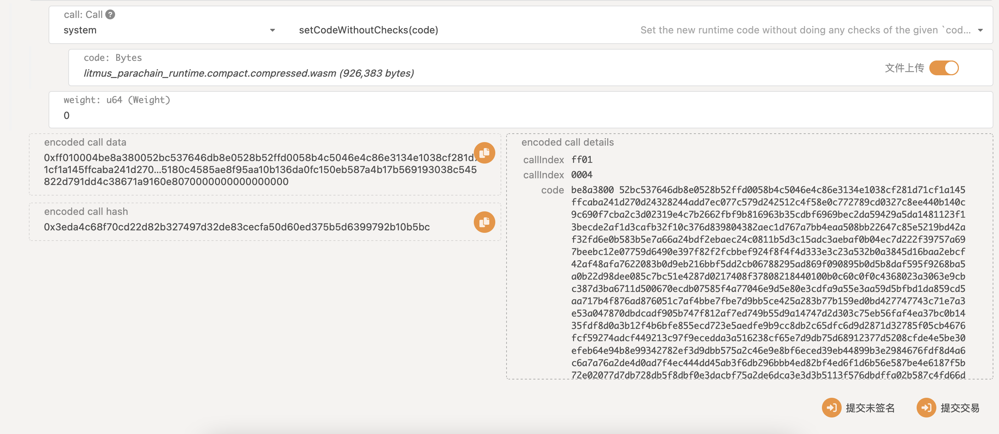

# 代码审核标准

该文档旨在提供一个完整的代码审核标准定义。本文档仅限本项目。

## Lint

本项目基于Rust实现，Rust工具链内提供了完整的一套lint工具，无论是代码格式，还是地道用法，都有相应的工具。

其中代码格式检查使用`cargo fmt`。

更地道的Rust写法检查使用`cargo clippy`。

这两个检查现在都已经集成到github 的 action 脚本，因此这部分代码质量只需要完整跑完github检查即可。

## Build

一个可用的项目必然要能够正常编译使用。

Rust提供了各种编译期检查，能完整的编译运行是最基本的要求。

本项目的生产环境是在wasm虚拟机内运行，因此需要保证能够正常编译到wasm字节码。

这部分已经集成到了github的action同样只需要查看最新提交的PR是否能完整跑完github检查即可。

## Run

该项目仅仅是一个lib存在，因此不能直接运行，需要组装到相应的链上。

目前提供了一个组装好的平行链实现，基于[litentry的实现](https://github.com/pnsproject/litentry-parachain)。

该项目已经提供了完善的运行文档，但是考虑到大家对substrate的不熟悉，因此再提供一个更为详细的中文文档。

### 在服务器上编译并运行litentry平行链docker

1. 将litentry的项目`git clone`下来，并进入相应文件夹。

```shell
git clone https://github.com/litentry/litentry-parachain.git
cd litentry-parachain
```

2. 编译docker镜像

这一步实际上可以直接在docker hub拉取litentry已经编译好的镜像。

最好拉取最新的实现

```shell
make build-docker
```

3. 运行平行链节点和中继链节点

```shell
make launch-docker-litentry
```

注意，以上运行的事litentry的平行链，如果你想要跑litmus，请更改为：`launch-docker-litmus`，以下的清理，还有运行时编译都同理。

等待运行结束即可。

这种运行仅适用于开发环境，因此每次重新运行需要清楚一些本地数据，有专门的脚本可以清理：

```shell
make clean-docker-litentry
```

4. 通过浏览器`polkadot.js`钱包访问运行的平行链服务

进入substrate提供的polkadot钱包： https://polkadot.js.org/apps/#/explorer

在钱包左上角处选择`DEVELOPMENT`下的`Custom`，填写地址：`wss://polkanode.pns.link/litentry`

实际上是 `ws://polkanode.pns.link:9966` 但是因为我们通过`https`进入的钱包，所以钱包内的访问地址需要`wss`。

因此在我们自己的服务器上部署，已经提供好了一个`wss`的转发。

### 在本机上编译pns提供的litentry平行链，并通过浏览器钱包升级到运行中的链

通过之前的步骤，我们已经成功将平行链跑到了服务器上，接下来我们将要在本机上通过热更新的方式把pns的相关pallets实现更新到链上。

1. 编译本地项目

首先在你的电脑上找到一个合适的文件夹，将我们需要的项目`clone`下来：

```shell
git clone https://github.com/pnsproject/litentry-parachain.git
cd litentry-parachain
```

你需要确保你的电脑上有完整的Rust工具链，这部分不再文档中赘述。

编译wasm运行时：

```shell
make build-runtime-litentry
```

2. 通过浏览器`polkadot.js`钱包升级平行链

等待编译结束，检查是否存在以下文件：

`./target/release/wbuild/litentry-parachain-runtime/litentry_parachain_runtime.compact.compressed.wasm`

打开浏览器，进入之前说到的平行链页面：



点击开发者按钮，选择交易：



点击账户为`ALICE`，交易模块为`sudo`：



交易选择`sudoUnheckedWeight`:



call选择`system`，交易选择`setCodeWithoutChecks`：



勾选上`文件上传`,之后选择之前我们编译出来的`wasm`文件：

`./target/release/wbuild/litentry-parachain-runtime/litentry_parachain_runtime.compact.compressed.wasm`



最后选择提交交易，等待交易完成，即可完成升级。

### 从浏览器调用接口

完成升级后，你便可以通过浏览器上的交易模块进行相应的测试。

## Test

单元测试是衡量代码质量的重要途径，本项目也提供了相关的单元测试，但一个人的考虑终究不够全面，因此这部分代码如果有新的测试用例是最合适的。

### 为什么解析器部分没有测试模块？

解析器部分确实没有单独的测试模块，这是因为当前解析器必须和注册中心放到同一条链上做链校验，因此作为注册中心的一个包引入到了测试模块。

简单来说就是它的测试模块和`pns-registrar`放到了一起。

### 怎么运行测试用例？

测试用例使用`cargo test`就可以运行：

```shell
cargo test
```

并且这部分已经集成到了github的action脚本内部，即每次提交的PR都会被检查是否通过测试用例。

因此你不需要在自己电脑上搭建Rust编译环境也可以判断测试用例是否通过。

### 为什么测试用例只有五个，正常来说每个可以调用的接口不应该都有对应的测试用例么？

确实每个调用接口都应该有相应的测试用例，但是因为部分接口之间的耦合度十分高，因此都集成到了一个测试用例里面。

说是一个测试用例，但实际上并不是，在一个测试用例了包含了一系例现实生活中对应的使用场景测试。

## Benchmarks

这部分不仅仅是基准测试，更是为了生成合理的weight值（对应以太坊的gas费）

### 如何运行benchmarks？

运行benchmark是一个较为复杂的过程，但实际上已经有了相关的脚本减少了很多代码量。

我们运行benchmark的目的是测试在相应的链上的调用成本，因此不能在测试环境进行测试，甚至我们不应该在自己的机器上进行benchmark的数据生成。

benchmark的数据应该在特定的机器上生成，这样才有可参考性。

但在本机上开发测试benchmark功能是否完整是有必要的，运行方法如下：

进入到之前克隆下的`pnsproject/litentry-parachain`项目：

编译benchmark版本的运行时：

```shell
make build-node-benchmarks
```
编译完成之后执行以下命令即可：

```shell
./scripts/benchmark-weight-local.sh litmus pns_resolvers::resolvers runtime
./scripts/benchmark-weight-local.sh litmus pns_registrar::origin runtime
./scripts/benchmark-weight-local.sh litmus pns_registrar::price_oracle runtime
./scripts/benchmark-weight-local.sh litmus pns_registrar::registrar runtime
./scripts/benchmark-weight-local.sh litmus pns_registrar::redeem_code runtime
./scripts/benchmark-weight-local.sh litmus pns_registrar::registry runtime
./scripts/benchmark-weight-local.sh litentry pns_resolvers::resolvers runtime
./scripts/benchmark-weight-local.sh litentry pns_registrar::origin runtime
./scripts/benchmark-weight-local.sh litentry pns_registrar::price_oracle runtime
./scripts/benchmark-weight-local.sh litentry pns_registrar::registrar runtime
./scripts/benchmark-weight-local.sh litentry pns_registrar::redeem_code runtime
./scripts/benchmark-weight-local.sh litentry pns_registrar::registry runtime%
```

### 如何查看benchmarks结果

结果作为`weight`写入到了代码中，在相应的运行时模块内都可以找到相应的代码：

以`litentry`为例：

```tree
runtime/litentry
├── Cargo.toml
├── build.rs
└── src
    ├── constants.rs
    ├── lib.rs
    ├── migration.rs
    ├── tests
    │   ├── mod.rs
    │   ├── setup.rs
    │   └── transaction_payment.rs
    ├── transaction_payment.rs
    └── weights
        ├── frame_system.rs
        ├── mod.rs
        ├── pallet_balances.rs
        ├── pallet_collator_selection.rs
        ├── pallet_collective.rs
        ├── pallet_democracy.rs
        ├── pallet_identity.rs
        ├── pallet_membership.rs
        ├── pallet_multisig.rs
        ├── pallet_proxy.rs
        ├── pallet_scheduler.rs
        ├── pallet_timestamp.rs
        ├── pallet_treasury.rs
        ├── pallet_utility.rs
        ├── pns_registrar // 都在这里
        │   ├── mod.rs
        │   ├── origin.rs
        │   ├── price_oracle.rs
        │   ├── redeem_code.rs
        │   ├── registrar.rs
        │   └── registry.rs
        └── pns_resolvers
            ├── mod.rs
            └── resolvers.rs
```

## 代码逻辑

本项目基本覆盖了完整的中文注释，详细代码逻辑请检查代码注释。

同时本项目遗留了一些TODO需要完成，这些TODO如果对后续项目结构有破坏性影响，应该在审查的时候特地指出来。


## 审查步骤

我的建议是将本项目的主分支作为PR，提交到一个空分支，这样可以方便的指出哪一行代码存在问题。